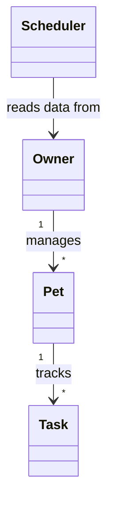

# PawPal+ (Module 2 Project)

PawPal+ is a smart pet care planner built with Python and Streamlit. The project uses object-oriented design to model owners, pets, and care tasks, then applies scheduling logic to organize the day in a way that is easy to understand and verify.

## Scenario

A busy pet owner needs help staying consistent with pet care. PawPal+ helps track responsibilities like walks, feedings, medications, and clean-up tasks while organizing them into a clear daily plan.

## Features

- Add and manage multiple pets for one owner
- Create pet care tasks with time, duration, priority, notes, and recurrence
- Sort tasks chronologically for a clean daily schedule
- Filter tasks by pet name and completion status
- Detect exact-time conflicts and return readable warnings
- Auto-generate the next occurrence when a daily or weekly task is completed
- Build a daily plan that considers available time and prioritizes important tasks first
- Display schedule explanations in both the CLI demo and the Streamlit app

## Smarter Scheduling

The scheduler layer adds four main algorithmic behaviors:

1. Time sorting with a stable key based on due date and `HH:MM` task time
2. Filtering by pet and completion status so the owner can focus on the right tasks
3. Recurrence handling for daily and weekly care items using `timedelta`
4. Conflict detection that warns the user when two tasks happen at the same exact time

One design tradeoff is that conflict detection only checks for exact matching start times, not overlapping durations. I kept that version because it is lightweight, readable, and easy to verify for this project scope.

## System Design

The final class structure is captured in [`uml_final.mmd`](./uml_final.mmd). Mermaid source:



Core responsibilities:

- `Owner` stores household-level information and access to all pets
- `Pet` stores pet details and its task list
- `Task` stores schedule data, completion state, and recurrence behavior
- `Scheduler` organizes tasks, creates plans, and detects conflicts

## Running the Project

### Setup

```bash
python -m venv .venv
.venv\Scripts\activate
pip install -r requirements.txt
```

### Run the CLI demo

```bash
python main.py
```

### Run the Streamlit app

```bash
streamlit run app.py
```

## Testing PawPal+

Run the automated test suite with:

```bash
python -m pytest
```

The tests cover:

- Task completion status changes
- Adding tasks to a pet
- Chronological sorting
- Daily recurrence behavior
- Conflict detection for duplicate times

Confidence Level: 4/5 stars. The current system is reliable for the required behaviors, and the next edge cases I would test are invalid user edits in the UI, overlapping durations, and persistence between app sessions.

## Demo

The app includes:

- A pet creation form
- A task scheduling form
- A filtered task table
- A daily smart plan with explanation text
- Conflict warnings shown with Streamlit status components


## AI Collaboration Notes

I used AI support mainly for design brainstorming, thinking through class relationships, and comparing algorithmic options. The most useful pattern was asking for a small, focused improvement at each step instead of generating the whole project at once. That made it easier to verify the logic and keep the code readable.
