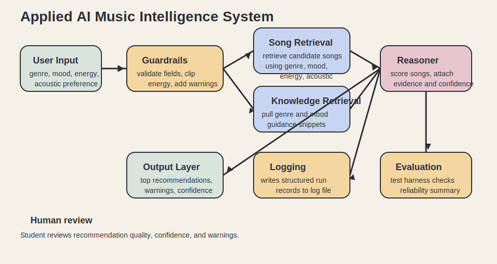

# Applied AI Music Intelligence System

This project extends my original Module 3 project, `ai110-module3show-musicrecommendersimulation-starter-main`. The original version was a content-based music recommender that ranked songs from a small CSV catalog using genre, mood, energy, and acoustic preference. For Week 8, I redesigned it into a fuller applied AI system that retrieves supporting context before ranking songs, estimates confidence, logs each run, and includes a reliability test harness.

## Why This Matters

Music recommendation is a good small-scale AI problem because it mixes structured retrieval, reasoning, explanation, and trust. Instead of returning a plain score, this version shows what context it retrieved, why the result is trustworthy or uncertain, and how the system behaves under evaluation.

## Main AI Feature

This system uses a retrieval-augmented recommendation pipeline:

- It retrieves candidate songs from `data/songs.csv` using genre, mood, energy, and acoustic cues.
- It retrieves supporting knowledge snippets from `data/listening_guides.json`.
- It combines that retrieved evidence with scoring logic to produce recommendations, explanations, and confidence scores.

This retrieval step directly changes system behavior because only retrieved candidates move into the ranking stage, and the retrieved guidance is included in the final explanation layer.

## Architecture Overview

The system has five main parts:

- Input and guardrails: normalize user preferences, clip unsupported energy values, and warn when a request falls outside the known knowledge base.
- Retriever: pull candidate songs and matching knowledge snippets.
- Reasoner: score retrieved songs with the original recommender logic plus retrieval evidence.
- Reliability layer: estimate confidence, log each run, and evaluate predefined cases.
- Human review: the user can inspect warnings, retrieved context, and outputs before trusting the recommendation.

System diagram:



## Project Structure

```text
assets/
data/
logs/
src/
tests/
README.md
model_card.md
requirements.txt
```

## Setup Instructions

1. Open a terminal in this project folder.
2. Create a virtual environment:

```bash
python -m venv .venv
```

3. Activate it on Windows:

```bash
.venv\Scripts\activate
```

4. Install dependencies:

```bash
pip install -r requirements.txt
```

5. Run the end-to-end demo:

```bash
python -m src.main
```

6. Run the automated tests:

```bash
pytest
```

## Sample Interactions

### Example 1

Input:

```python
{"genre": "pop", "mood": "happy", "energy": 0.8, "likes_acoustic": False}
```

Output summary:

- Top recommendation: `Sunrise City`
- Confidence: `0.83`
- Retrieved context includes `genre:pop`, `mood:happy`, and `preference:studio`
- Why it ranked well: exact genre match, exact mood match, close energy, and low acousticness

### Example 2

Input:

```python
{"genre": "lofi", "mood": "chill", "energy": 0.4, "likes_acoustic": True}
```

Output summary:

- Top recommendation: `Library Rain`
- Confidence: `0.93`
- Retrieved context includes `genre:lofi`, `mood:chill`, and `preference:acoustic`
- Why it ranked well: exact genre match, exact mood match, close energy, and strong acoustic fit

### Example 3

Input:

```python
{"genre": "reggaeton", "mood": "focused", "energy": 1.2, "likes_acoustic": False}
```

Output summary:

- Guardrail warning: unknown genre and clipped energy value
- Top recommendation: `Night Drive Loop`
- Confidence is lower because the request falls outside the modeled catalog
- The system still returns a safe fallback instead of crashing

## Design Decisions and Trade-Offs

- I kept the original weighted scoring logic because it was already explainable and easy to test.
- I added retrieval instead of a larger black-box model because the rubric emphasizes responsible design and clear reasoning.
- I used a small JSON knowledge base rather than an API or embedding model so the project stays reproducible for grading.
- Confidence scoring is heuristic, not learned, which makes it inspectable but less sophisticated than a production system.

## Reliability and Evaluation

The project includes:

- Automated tests in `tests/test_recommender.py`
- Confidence scoring for each recommendation
- Logging to `logs/system.log`
- An evaluation harness in `src/evaluation.py`

Evaluation summary from the included harness:

- `3 of 3` predefined cases passed
- Average confidence was `0.88`
- The system was strongest when the requested genre and mood existed in the catalog
- Reliability dropped when the user asked for an out-of-scope genre, but the guardrails kept the output usable

## Testing Summary

What worked:

- Retrieval narrowed the candidate list in ways that matched the user request
- Confidence scores were higher for well-supported cases
- Guardrails prevented bad input from breaking the run

What did not work as well:

- Unknown genres still rely on fallback matching, so those results are less personalized
- The tiny dataset means the system can look more confident than it would be on a messy real catalog

## Reflection

This project taught me that useful AI systems are not only about generating an answer. They need structure around the answer: retrieval, guardrails, testing, and honest signals about uncertainty. Building the reliability layer made the system feel more professional and more responsible than the original prototype.

It also reinforced that explainability is a design choice. Even a small AI system becomes easier to trust when the user can see what evidence was retrieved and why the recommendation was made.

## Loom Walkthrough

Add your Loom link here before submitting:

`PASTE-LOOM-LINK-HERE`

## Portfolio Note

This project shows that I can take a small prototype and turn it into a more complete AI system with retrieval, reliability checks, logging, and clear documentation. It reflects the way I approach AI engineering: make the system useful, testable, and honest about its limits.
